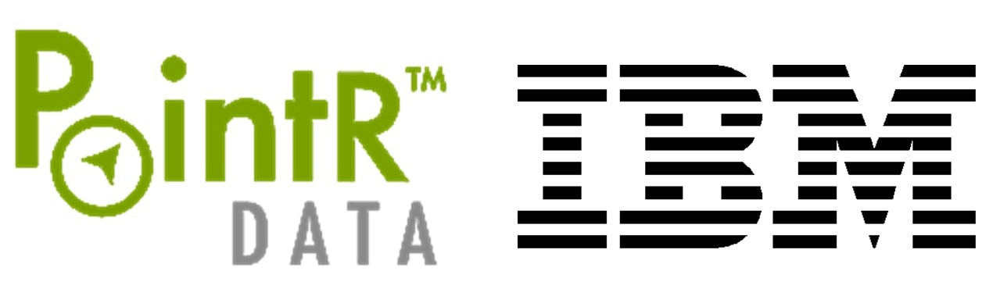
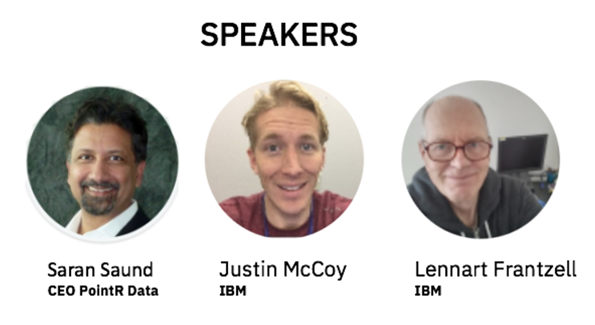

# Machine Learning and PowerAI Workshop

Galvanize - San Francisco (SoMa) [map](https://www.google.com/maps/place/Galvanize+-+San+Francisco+(SoMa)/@37.7876172,-122.3988267,17z/data=!3m1!4b1!4m5!3m4!1s0x8085807cb94a8b83:0x3cfc91016a294580!8m2!3d37.787613!4d-122.396638)

Wed, September 19, 2018
6:00 PM – 9:00 PM PDT

## Overview

Come join developers from PointR and IBM PowerAI to learn what we're doing to build the development platform for artificial intelligence, and how that platform has been leveraged to build and find insights.

Several years under development, PointR Data Inc., (www.pointrdata.com) brings a wireless mesh compute network to the edge. The low-power, high performance sensor and compute hub fabric provides machine vision inferencing for autonomous retail stores, warehouse logistics, transportation inspection and surveillance use cases. Called the PointR CUBE, the wireless mesh hub packs cluster of tiny AI accelerators with tightly integrated frameworks that enable developers to create and launch multi-stage pipelined deep neural networks that were trained on IBM Power hardware and infrastructure software.

Learn about PointR, how they leveraged deep learning and GPU computing, and see a live demo.

You'll walk away with:

* An overview of the AI landscape
* A guide to PointR's SDKs
* A guide to Deep Learning and GPU Computing in the Cloud
* Resources to get started with IBM's AI Platforms

## Agenda

| Time | | Slides |
| ------- | ------------------------ | ------ |
| 6:00PM  | Networking |
| 6:20PM  | Kickoff by [Scott Soutter](https://www.linkedin.com/in/scott-soutter-706773/) | 
| 6:30PM  | Intro to AI and ML at IBM | [Slides](resources/intro-to-ai-and-ml.pdf) |
| 7:00PM | Introducing PointR Data | |
| 8:00PM | Rise of GPU Computing w/PowerAI +Demo | [Slides](resources/rise-of-gpu-computing.pdf) |
| 8:50PM | Wrap-up | |

---

* **[Saran Saund](https://www.linkedin.com/in/saransaund/)**, Co-Founder and CEO at PointR Data Inc. His recent projects include deep neural networks and machine learning in diverse applications from genetic sequencing to video analytics. Advisor to early-stage ventures and F500-companies; Saran is passionate about applying technology innovations to real world markets. Timing is everything. Sometimes a little early (digital cash in the 90s!) and others right on-the-money. In 2008 he sold PicoMobile to Marvell (MRVL) returning 10X to early shareholders. He started his career at Xerox PARC pushing 1’s and 0’s as a software engineer.

* **[Justin McCoy](https://www.linkedin.com/in/mccoyjus/)**, IBM Developer Advocate in Austin. SSculpting a beautiful and simplified world through software and art. With 12 years of experience bringing the latest open source technologies to enterprise with IBM’s big iron, he knows what it takes to move from idea to production. With a passion for the client experience, he is currently focused on Cloud Computing, Watson, Serverless, and Data Science. You’ll usually find him playing ultimate frisbee, running, or talking about the future of technology.

* **[Lennart Frantzell](https://www.linkedin.com/in/lennartfrantzell/)**, IBM Developer Advocate in San Francisco. Working with Blockchain, Hyperledger, Fintech and Watson. Following AI and driverless cars. Thrives in San Francisco, Seattle, Vancouver and Malmö in my native Sweden. Engaging with developers and startups. Doing Meetups, industry events and Hackathons. Blogging on Medium. Walking in the mountains.

## Additional Resources

* [Try PowerAI](https://developer.ibm.com/linuxonpower/deep-learning-powerai/try-powerai/)
* [PowerAI Docker Image](https://hub.docker.com/r/ibmcom/powerai/)
* [Access to PowerAI on IBM Cloud](https://console.bluemix.net/catalog/services/powerai)
* [Deep Learning Use Cases](resources/deep-learning-usecases.pdf)
* [Nimbix HPC Cloud](https://www.nimbix.net/ibm/)
* **Code Examples**
    * [Object Detection in Video](https://developer.ibm.com/code/patterns/locate-and-count-items-with-object-detection/)
    * [Keras CNN Binary Classification](https://github.com/justinmccoy/keras-binary-classifier)
    * [Breast Cancer Detection](https://developer.ibm.com/linuxonpower/2018/05/11/breast-cancer-classification-ibm-powerai-vision/)
    * [SETI Signal Classification](https://github.com/fbarilla/SETI-Journey-Map)
* Recordings of PowerAI Demos
    * [Image Classification](https://www.youtube.com/watch?v=KN7Q5mXUwds)
    * [Object Detection and Classification](https://www.youtube.com/watch?v=sd34Q4tm1es)
    * [Object Detection using videos for training data](https://www.youtube.com/watch?v=2zHiUMw6RPk)

